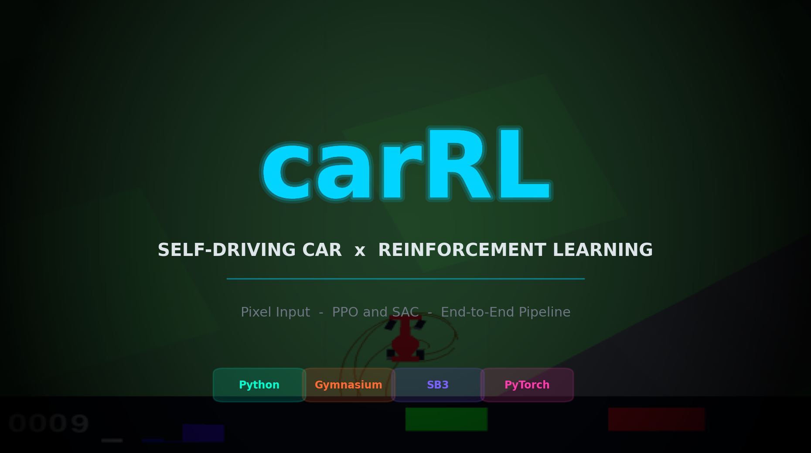
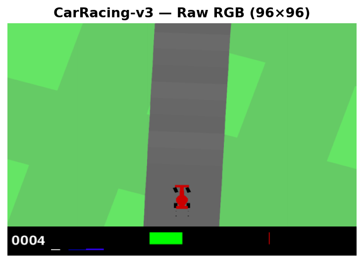
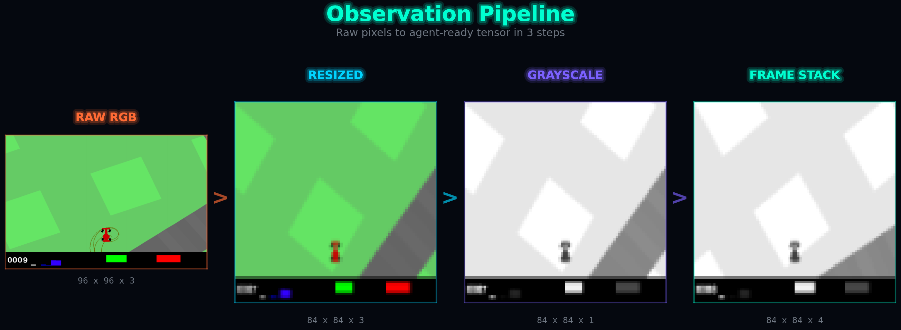
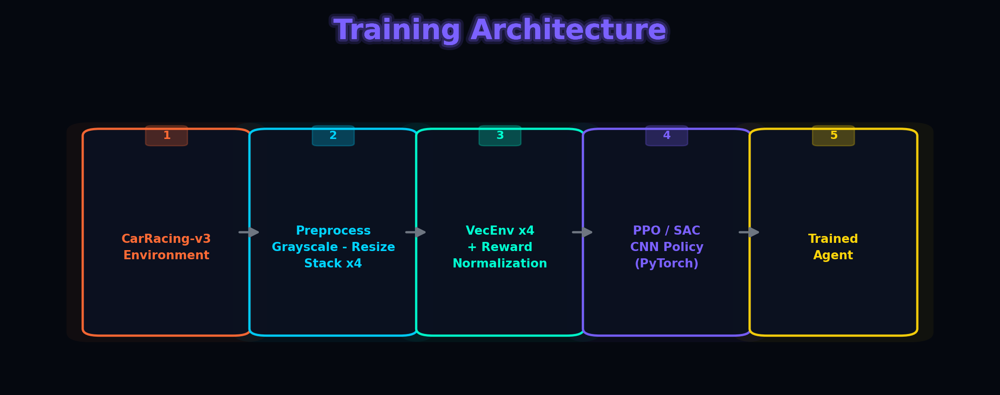
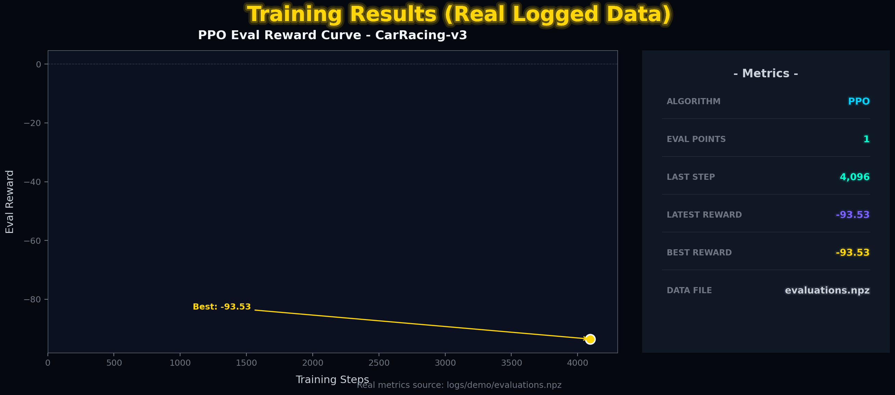
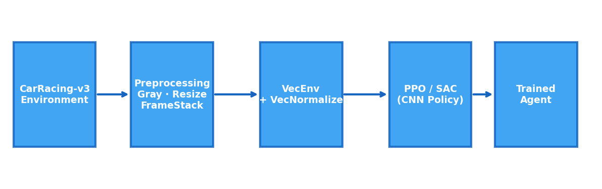
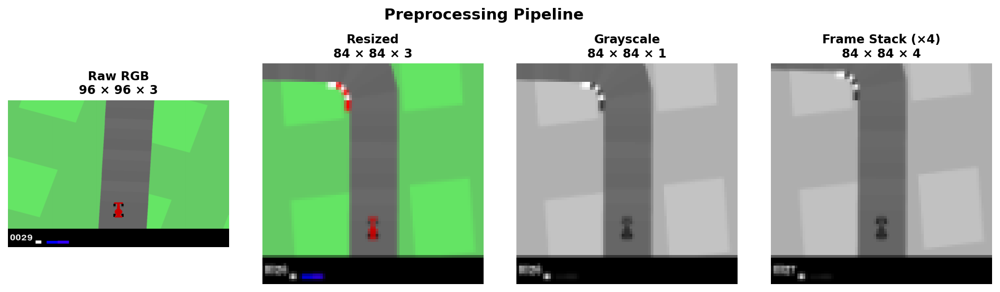

# Self-Driving Car RL Project (CarRacing-v3)

A clean, end-to-end reinforcement learning pipeline for self-driving in
[Gymnasium CarRacing-v3](https://gymnasium.farama.org/environments/box2d/car_racing/)
using raw pixel input.

<p align="center">
    
 
</p>

<p align="center">
   
  
</p>
<p align="center">
  
  
</p>

## Features

- **PPO / SAC agents** via Stable-Baselines3
- Image preprocessing: grayscale, resize, frame stacking, action clipping
- Vectorized training with reward normalization
- Config-driven experiments (YAML)
- Evaluation & video recording scripts
- Installable CLI (`carrl train / eval / record-video`)

## Architecture

<p align="center">
  
</p>

## Preprocessing Pipeline

<p align="center">
  
</p>


## Quick Start

```bash
# 1. Create & activate a virtual environment
python -m venv .venv
.venv\Scripts\activate   # Windows
# source .venv/bin/activate  # Linux / macOS

# 2. Install the package (editable) + dev tools
pip install -e ".[dev]"

# 3. Train (PPO, 1 M steps, default config)
carrl train --config configs/baseline.yaml

# 4. Evaluate
carrl eval --model-path models/baseline.zip --episodes 10

# 5. Record a video
carrl record-video --model-path models/baseline.zip --video-path videos/agent.mp4
```

## CLI

```
$ carrl --help
usage: carrl [-h] {train,eval,record-video} ...

carRL — Self-Driving Car RL Pipeline

positional arguments:
  {train,eval,record-video}
    train               Train an RL agent
    eval                Evaluate a trained agent
    record-video        Record agent video
```

## Training Output

```
Using cpu device
Logging to logs/demo/PPO_1
Eval num_timesteps=4096, episode_reward=-93.53 +/- 0.00
Episode length: 1000.00 +/- 0.00
---------------------------------
| eval/              |          |
|    mean_ep_length  | 1e+03    |
|    mean_reward     | -93.5    |
| time/              |          |
|    total_timesteps | 4096     |
---------------------------------
New best mean reward!
---------------------------------
| rollout/           |          |
|    ep_len_mean     | 1e+03    |
|    ep_rew_mean     | -51.9    |
| time/              |          |
|    fps             | 40       |
|    iterations      | 1        |
|    time_elapsed    | 99       |
|    total_timesteps | 4096     |
---------------------------------
```

Result plots should be generated from real experiment logs (for example,
`logs/demo/evaluations.npz`) rather than synthetic curves.

## Advanced Training (direct script)

You can also run the training script directly for full CLI control:

```bash
python -m carRL.scripts.train \
    --algo PPO \
    --total-timesteps 1000000 \
    --n-envs 4 \
    --vec-norm \
    --seed 0 \
    --save-path models/baseline.zip \
    --log-dir logs
```

**TensorBoard:**

```bash
tensorboard --logdir logs
```

## Configs

Experiment configs live in `configs/`:

| File | Description |
|------|-------------|
| `baseline.yaml` | PPO, 1 M steps, 4 envs, full preprocessing |
| `ppo.yaml` | PPO with tuned hyperparameters |
| `sac.yaml` | SAC variant for continuous-action comparison |

Key options: `n_envs`, `vec_norm`, `frame_stack`, `resize`,
`grayscale`, `clip_action`.

## Project Structure

```
carRL/
├── assets/             # README images + visuals/video
├── configs/            # YAML experiment configs
├── generate_assets.py  # creating README showcase images
├── src/carRL/
│   ├── cli.py          # Installable CLI entry point
│   ├── envs/           # Gymnasium wrappers
│   ├── scripts/        # train / eval / record_video
│   └── utils/          # I/O, logging, seeding helpers
├── tests/              # Pytest sanity checks
├── pyproject.toml      # Packaging & metadata
└── requirements.txt    # Pinned dependencies
```

## Testing

```
$ pytest -v
tests/test_wrappers.py::test_env_defaults PASSED
tests/test_wrappers.py::test_env_rgb_no_stack PASSED
tests/test_wrappers.py::test_clip_action_enabled_by_default PASSED
tests/test_wrappers.py::test_clip_action_can_be_disabled PASSED
4 passed
```

## License

MIT — see [LICENSE](LICENSE).
